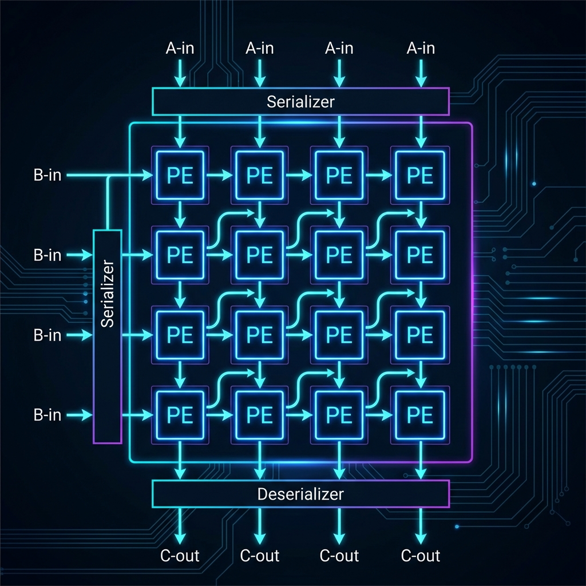

# 🚀 Systolic Array Hardware Accelerator for CNNs

[](https://en.wikipedia.org/wiki/SystemVerilog)
[](https://skywater-pdk.readthedocs.io/)
[](LICENSE)
[](docs/ARCHITECTURE.md)

A high-performance, parameterizable **Systolic Array Accelerator (Default 8x8)** implemented in SystemVerilog, designed for efficient Matrix-Matrix Multiplications (GEMM) in Deep Learning workloads. This project features a complete ASIC flow targeting the **SkyWater 130nm PDK** using the **LibreLane** (OpenLane 2) toolchain.

---

## 📖 Table of Contents
- [Overview](#overview)
- [Key Features](#key-features)
- [Hardware Architecture](#hardware-architecture)
- [ASIC Implementation](#asic-implementation)
- [Getting Started](#getting-started)
- [Verification](#verification)

---

## 🌟 Overview
In modern AI silicon (like NVIDIA's Tensor Cores), systolic arrays are the standard for high-throughput tensor computations. This project implements a **Weight-Stationary-ready** systolic architecture that minimizes data movement and maximizes Processing Element (PE) utilization through spatial parallelism.



---

## ✨ Key Features
- **Highly Modular PE Design**: Pipelined MAC units with 8-bit signed inputs and 32-bit accumulators (Int8/Int32).
- **Spatial Parallelism**: 64 PEs (8x8) operating in parallel with systolic data propagation.
- **ASIC Optimized**: Serialized I/O interface to reduce pin count, targeting high-density cell-based layouts.
- **Toolchain Compatible**: RTL optimized for Yosys synthesis (flattened interfaces, Verilog-2001 compatibility).
- **LibreLane Ready**: Complete configuration for the modern LibreLane ASIC flow.

---

## 🏗️ Hardware Architecture

### Processing Element (PE)
Each PE performs $C = C + (A \times B)$. It is designed with architectural registered outputs to ensure high-frequency timing closure.

### Dataflow Strategy
The array uses an **Input Skewing** technique where Matrix A rows and Matrix B columns are delayed by their respective indices.

> [Read the full ARCHITECTURE.md here](docs/ARCHITECTURE.md)

---

## 🎨 ASIC Implementation

The project includes a production-grade **LibreLane** configuration for the SkyWater 130nm process.

**Location:** `scripts/librelane/`

### Quick Start (Docker)
```bash
# Run the full ASIC flow
librelane scripts/librelane/config.json --design-dir . --dockerized
```

> [Read the full LIBRELANE_GUIDE.md here](docs/LIBRELANE_GUIDE.md)

---

## 🛠️ Getting Started

### Prerequisites
- **Icarus Verilog**: For simulation.
- **GTKWave**: For waveform viewing.
- **Docker**: For running the ASIC flow.

### Quick Simulation
```bash
# Compile
iverilog -g2012 -o tb_sys.vvp -I src/rtl src/rtl/pe_mac.sv src/rtl/systolic4x4.sv src/tb/tb_systolic4x4.sv

# Run
vvp tb_sys.vvp
```

---

## ✅ Verification

The design is verified using a self-checking testbench that compares hardware results against a golden behavioral model.

- **Block Level**: `src/tb/tb_systolic4x4.sv` checks the core array logic.
- **Top Level**: `src/tb/tb_top_iverilog.sv` checks the serialized ASIC wrapper.

> [Read the full VERIFICATION.md here](docs/VERIFICATION.md)

---

## 📄 License
This project is licensed under the MIT License - see the [LICENSE](LICENSE) file for details.
