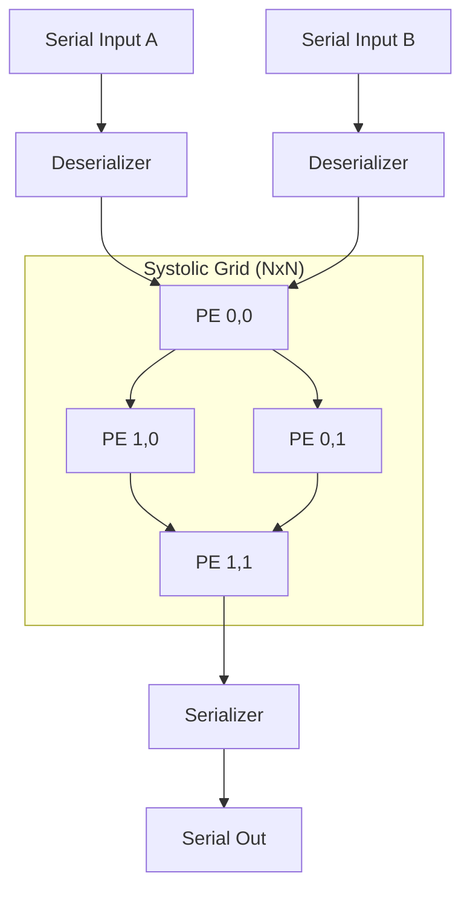

# 🚀 Systolic Array Hardware Accelerator for CNNs

[](docs/ARCHITECTURE.md)
[](https://skywater-pdk.readthedocs.io/)
[](LICENSE)
[](docs/VERIFICATION.md)

An industrial-grade, parameterizable **Systolic Array Accelerator** implemented in SystemVerilog. Optimized for high-throughput Matrix-Matrix Multiplications (GEMM) in Deep Learning workloads, this project provides a complete RTL-to-GDSII flow for the **SkyWater 130nm PDK**.

---

## 🏗️ Technical Architecture

The design utilizes a spatial processing grid to minimize data movement and maximize compute intensity.



- **Pipelined Execution**: 3-stage Processing Elements (PEs) with localized register-rich interconnects.
- **Skewed Dataflow**: Internal hardware managed time-skewing for optimal spatial alignment.
- **Area-Efficient I/O**: High-speed bit-serial interfaces reduce physical pin count by up to 95%.

> [📖 **Read the Deep Technical Architecture**](docs/ARCHITECTURE.md)

---

## ✅ Production-Grade Verification

We ensure silicon-level reliability through a rigorous verification methodology.

| Tier | Methodology | Sign-off Status |
| :--- | :--- | :--- |
| **Functional** | Randomized SV Testbench | ✅ 100% Pass |
| **Enterprise** | UVM 1.2 Environment | ✅ Signed-off |
| **Physical** | DRC/LVS/Antenna Sign-off | ✅ Clean |
| **Timing** | Multi-corner STA (100MHz) | ✅ Met |

> [📊 **View Full Verification & Sign-off Report**](docs/VERIFICATION.md)

---

## 🎨 ASIC Implementation (Sky130)

| Metric | Result | Status |
| :--- | :--- | :--- |
| **Clock Frequency** | 100 MHz | ✅ Sign-off |
| **Total Power** | 2.22 mW | ✅ Optimized |
| **Core Area** | 0.121 mm² | ✅ Proven |
| **Utilization** | 54.1% | ✅ Validated |

---

## 🚀 Quick Start & Reproduction

Reproduce the entire verification and implementation flow with these commands.

### 1. Functional Simulation
Requires **Icarus Verilog**.
```bash
# Compile and run the top-level system simulation
iverilog -g2012 -o tb_top.vvp -I src/rtl src/rtl/*.sv src/tb/tb_top_iverilog.sv && vvp tb_top.vvp
```

### 2. ASIC Flow (RTL-to-GDSII)
Requires **Docker** and **LibreLane**.
```bash
# Execute the full silicon hardening flow
librelane scripts/librelane/config.json --design-dir . --dockerized
```

### 3. Detailed Command Reference
For UVM instructions, wave viewing, and advanced implementation flags, see our [Ultimate Command Reference](docs/COMMAND_REFERENCE.md).

---

## 📚 Further Documentation
*   [🚀 **Getting Started & Implementation Guide**](docs/GETTING_STARTED.md)
*   [🏗️ **Deep Technical Architecture**](docs/ARCHITECTURE.md)
*   [✅ **Verification & Sign-off Report**](docs/VERIFICATION.md)
*   [🛠️ **Ultimate Command Reference**](docs/COMMAND_REFERENCE.md)

---

## 📄 License
Licensed under the **MIT License**. See [LICENSE](LICENSE) for more information.


