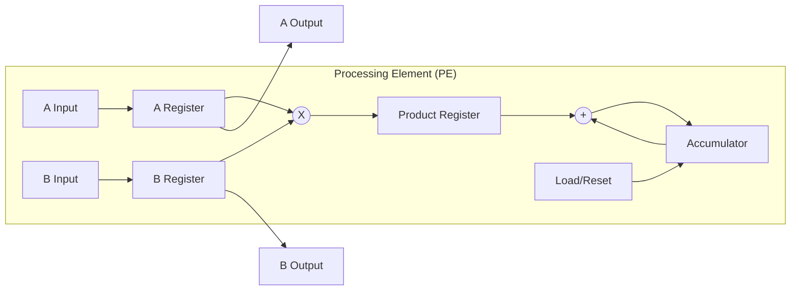
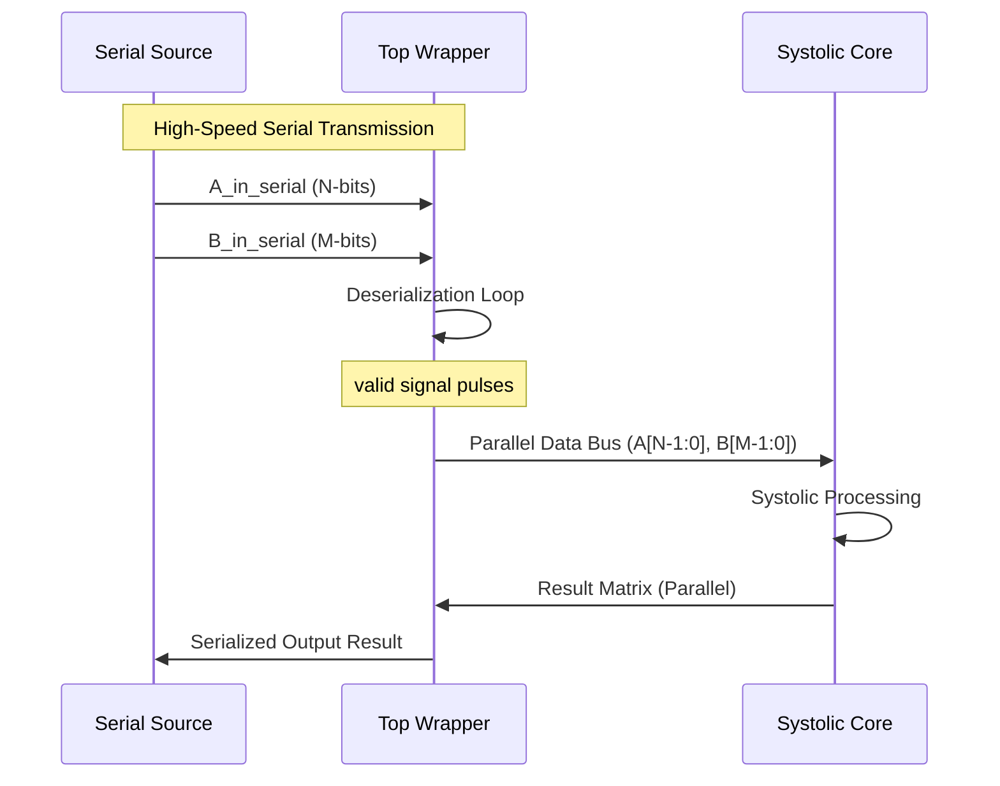

# 🏗️ Deep Technical Architecture: Systolic Array Accelerator

This document provides a comprehensive, in-depth technical analysis of the Systolic Array Hardware Accelerator. It covers configuration parameters, microarchitectural details, gate-level implementation, dataflow strategies, and physical design considerations for the **SkyWater 130nm** process.

---

## 🧭 1. Architectural Philosophy

The design targets **Int8 inference acceleration** for Convolutional Neural Networks (CNNs). The primary objective is to maximize **Compute Intensity** (Operations per DRAM byte access) by utilizing a spatial processing grid that minimizes data movement.

### Core Design Principles:
*   **Register-Rich Interconnect**: Every Processing Element (PE) is bounded by registers. This localized communication ensures that signal propagation delay is independent of the total array size, enabling high-frequency operation (>100MHz on Sky130).
*   **Stationary Dataflow**: Optimized for weight-stationary or output-stationary mappings through flexible control signaling.
*   **Serialized I/O for Silicon Efficiency**: To resolve the "Pin-Limited" bottleneck of ASIC designs, a high-speed serial interface is used to feed the wide systolic parallel bus.

---

## 🛠️ 2. Configuration Parameters

The architecture is fully generic and defined by SystemVerilog parameters.

| Parameter | Default | Description | Impact on Hardware |
| :--- | :--- | :--- | :--- |
| **`AW`** | 8 | **Input A Bit-Width**. Signed INT8. | Increases FF count and Multiplier logic size. |
| **`BW`** | 8 | **Input B Bit-Width**. Signed INT8. | Increases FF count and Multiplier logic size. |
| **`ACCW`** | 32 | **Accumulator Width**. | Prevents overflow for large-scale accumulations. |
| **`ROWS`** | 8 | **Array Height**. | Linear area scaling. Adds $+ROWS$ drain latency. |
| **`COLS`** | 8 | **Array Width**. | Linear area scaling. Adds $+COLS$ fill latency. |

---

## 🧩 3. Microarchitecture

### 3.1 Processing Element (PE) - `pe_mac.sv`
The PE is the fundamental compute unit, optimized for **Fmax** through a 3-stage pipeline.

*   **Stage 0: Operand Capture**: Registers `A_reg` and `B_reg` capture inputs. This prevents combinational paths from spanning multiple PEs.
*   **Stage 1: Signed Multiplication**: A $8 \times 8$ signed multiplier computes the partial product.
*   **Stage 2: Accumulation**: A 32-bit adder performs $Acc = Acc + Prod$. The `load_acc` signal is pipelined to align with data latency.

### 3.2 Top-Level Wrapper (ASIC Interface)
The top-level implements a robust **Serialization/Deserialization (SerDes)** layer to handle the high density of signals.

---

## 🌊 4. Systolic Dataflow & Timing

### 4.1 Input Skewing Technique
Systolic arrays require data to be "skewed" in time. Without skewing, data collision occurs as partial sums move through the grid.

**Visual Representation of Skewing (4x4 Array):**

| Cycle | Row 0 | Row 1 | Row 2 | Row 3 |
| :--- | :--- | :--- | :--- | :--- |
| **T0** | $A_{0,0}$ | - | - | - |
| **T1** | $A_{0,1}$ | $A_{1,0}$ | - | - |
| **T2** | $A_{0,2}$ | $A_{1,1}$ | $A_{2,0}$ | - |
| **T3** | $A_{0,3}$ | $A_{1,2}$ | $A_{2,1}$ | $A_{3,0}$ |

- **Mechanism**: The `systolic4x4.sv` uses shift-register chains on the boundaries to delay row $i$ by $i$ cycles and column $j$ by $j$ cycles.

---

## 💎 5. Physical Design & Signoff

Implementing a systolic array on silicon requires specific strategies handled by the **OpenLane 2** flow:

### 5.1 Floorplanning & Congestion
- **Global Placement**: We use `FP_CORE_UTIL = 55` to maintain a compact design while ensuring routability for the dense inter-PE routing.
- **Pin Positioning**: Serialized interfaces are placed on the south/north boundaries to minimize the 130nm bond-pad count.

### 5.2 Power Integrity
Systolic arrays exhibit high switching activity. To mitigate IR Drop:
- **PDN**: A dense Power Distribution Network is generated across Metal 4 and Metal 5.
- **Analysis**: Signoff includes PSM analysis to verify that the array remains stable under peak load.

---

## ⚖️ 6. Digital Design Trade-offs

| Feature | Design Choice | Rationale |
| :--- | :--- | :--- |
| **Arithmetic** | 2's Complement | Simplifies signed logic; native support in Yosys. |
| **Clocking** | Synchronous | Single primary clock ensures straightforward CTS. |
| **I/O** | Bit-Serial | Reduces pin count from ~1000 down to 15, enabling cheap QFN packaging. |
| **Buffer** | Register-Based | Avoids the complexity of SRAM interfaces for small-to-medium arrays. |

---

**End of Architecture Document**

